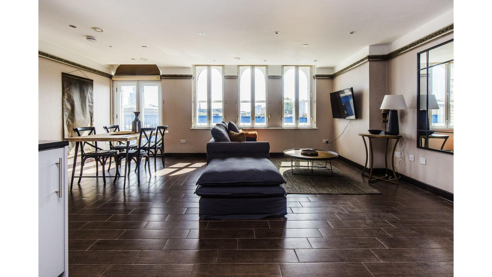

Brand New London Bridge Flat - 4S in London has accommodations with free WiFi, a 3-minute walk from Borough Market, 641 m from London Bridge and a 16-minute walk from Sky Garden. The property is 2.1 km from Tower of London and 3.1 km from Somerset House.

The apartment also provides a TV, a fully equipped kitchen with a microwave, a washing machine and a bathroom with a shower and a bath.

Tower Bridge is 1.8 km from the apartment, while St Paul's Cathedral is 1.9 km away. The nearest airport is London City Airport, 11.3 km from Brand New London Bridge Flat - 4S.

Southwark is a great choice for travelers interested in architecture, city walks and tourist attractions.

This is our guests' favorite part of London, according to independent reviews.

We speak your language!

## One of our best sellers in London!

Located a 6-minute walk from Brick Lane and a 4-minute walk from Aldgate East underground station, Commercial House is an aparthotel that features free WiFi.

The rooms and apartments at Commercial House have tea/coffee making facilities. They also feature flat-screen smart TVs and a private bathroom with bath or shower. Towels and bed linen are provided at this self-catering accommodations.

Liverpool Street train station is a 10-minute walk away. Popular points of interest near the aparthotel include Sky Garden, Tower of London and Tower Bridge. The nearest airport is London City Airport, 6.2 mi from Commercial House.

Tower Hamlets is a great choice for travelers interested in atmosphere, convenient public transportation and city walks.

This is our guests' favorite part of London, according to independent reviews.

Couples in particular like the location – they rated it 8.6 for a two-person trip.

We speak your language!
