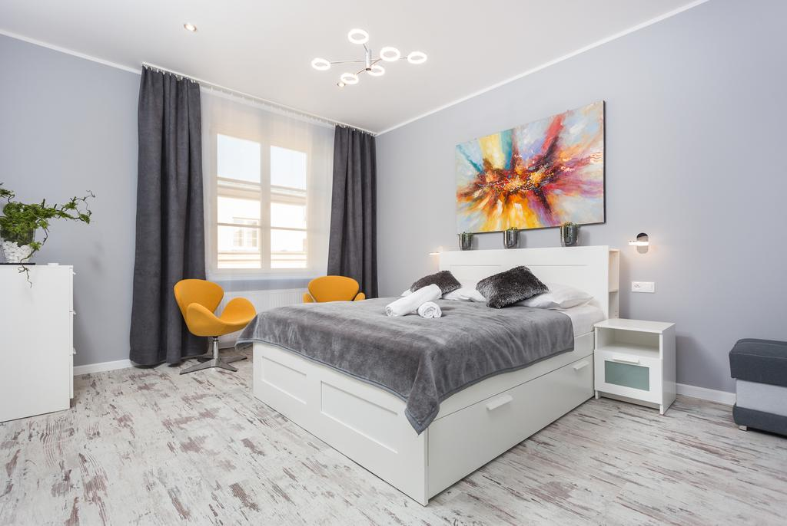

Located in the heart of Kraków, Mikołajska 5 Apartments are 150 m from the Main Market Square, with its historic Cloth Hall and St.Mary's Church. They offer accommodations with free Wi-Fi.

The apartments are classically furnished and decorated in modern style. They are located in a renovated historical building, and offer a view of the courtyard or the medieval Old Town streets. Each comes with a bathroom with a shower and a TV. Most come with a kichenette with an electric kettle, a toaster and complimentary tea and coffee. All come with hairdryers and towels.

Mikołajska 5 Apartments are 851 m from the Wawel Royal Castle and 0.6 mi from the historical Jewish Quarter of Kazimierz. Kraków Główny Train Station and Galeria Krakowska Shopping center are 751 m away.

Old Town is a great choice for travelers interested in restaurants, food and history.

## One of our best sellers in Krakow!

Located in the heart of Kraków, Mikołajska 5 Apartments are 150 m from the Main Market Square, with its historic Cloth Hall and St.Mary's Church. They offer accommodations with free Wi-Fi.

The apartments are classically furnished and decorated in modern style. They are located in a renovated historical building, and offer a view of the courtyard or the medieval Old Town streets. Each comes with a bathroom with a shower and a TV. Most come with a kichenette with an electric kettle, a toaster and complimentary tea and coffee. All come with hairdryers and towels.

Mikołajska 5 Apartments are 851 m from the Wawel Royal Castle and 0.6 mi from the historical Jewish Quarter of Kazimierz. Kraków Główny Train Station and Galeria Krakowska Shopping center are 751 m away.

Old Town is a great choice for travelers interested in restaurants, food and history.
