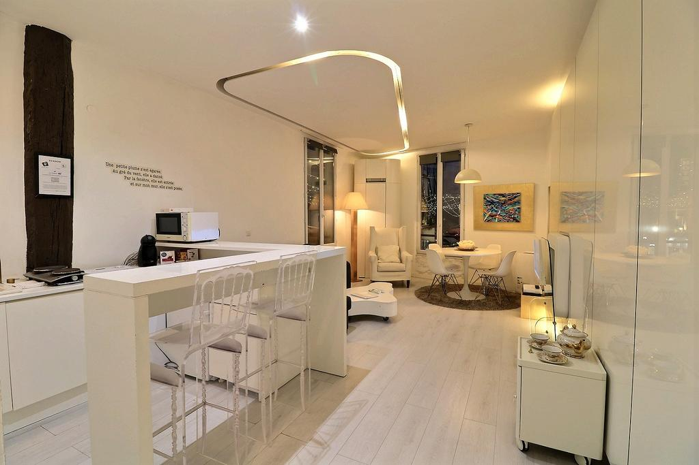

In the 6th arr. District of Paris, close to Louvre Museum, PARIS 6TH - ST ANDRE DES ARTS - LATIN QUATER features free WiFi and a washing machine. Guests staying at this apartment can use a fully equipped kitchen.

The air-conditioned apartment consists of 1 separate bedroom, 1 bathroom with a hairdryer and free toiletries, and a seating area. A flat-screen TV with satellite channels and a Blu-ray player are provided.

Popular points of interest near the apartment include Orsay Museum, Luxembourg Gardens and Sainte Chapelle. The nearest airport is Orly Airport, 17.7 km from PARIS 6TH - ST ANDRE DES ARTS - LATIN QUATER.

6th arr. is a great choice for travelers interested in food, cafes and restaurants.

This is our guests' favorite part of Paris, according to independent reviews.

## One of our best sellers in Paris!

In the 6th arr. District of Paris, close to Louvre Museum, PARIS 6TH - ST ANDRE DES ARTS - LATIN QUATER features free WiFi and a washing machine. Guests staying at this apartment can use a fully equipped kitchen.

The air-conditioned apartment consists of 1 separate bedroom, 1 bathroom with a hairdryer and free toiletries, and a seating area. A flat-screen TV with satellite channels and a Blu-ray player are provided.

Popular points of interest near the apartment include Orsay Museum, Luxembourg Gardens and Sainte Chapelle. The nearest airport is Orly Airport, 17.7 km from PARIS 6TH - ST ANDRE DES ARTS - LATIN QUATER.

6th arr. is a great choice for travelers interested in food, cafes and restaurants.

This is our guests' favorite part of Paris, according to independent reviews.
