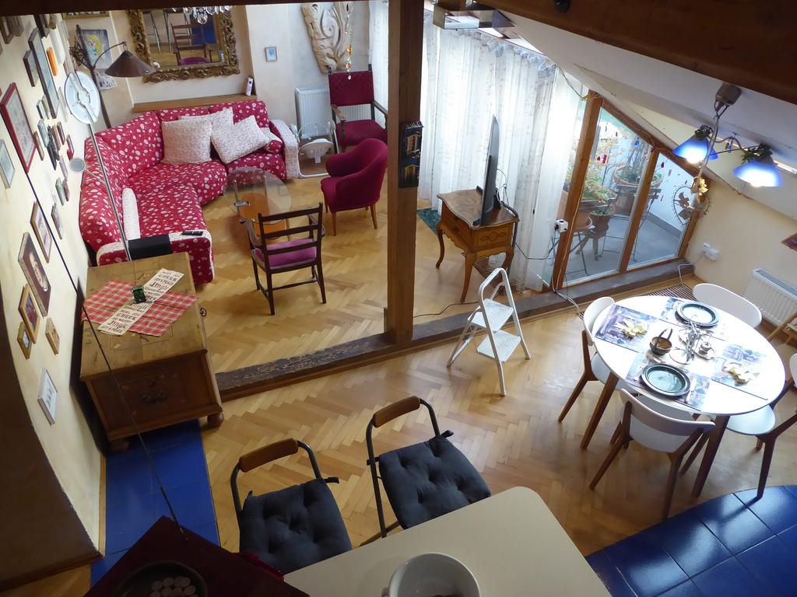

Located in Prague, within a 5-minute walk of Old Town Square and 549 m of Prague Astronomical Clock, Tiffany Loft offers accommodations with free WiFi, air conditioning, a restaurant and a terrace. Housed in a building dating from 1910, this apartment is 1.9 km from St. Vitus Cathedral and 2.9 km from Historical Building of the National Museum of Prague.

The apartment has 1 bedroom, 1 bathroom, a flat-screen TV with satellite channels, a dining area, a fully equipped kitchenette, and a patio with city views.

At the apartment guests are welcome to use a hot tub and a sauna.

Popular points of interest near Tiffany Loft include Municipal House, Charles Bridge and Prague Castle.

Prague 1 is a great choice for travelers interested in history, architecture and culture.

This is our guests' favorite part of Prague, according to independent reviews.

## One of our best sellers in Prague!

Located in Prague, within a 5-minute walk of Old Town Square and 549 m of Prague Astronomical Clock, Tiffany Loft offers accommodations with free WiFi, air conditioning, a restaurant and a terrace. Housed in a building dating from 1910, this apartment is 1.9 km from St. Vitus Cathedral and 2.9 km from Historical Building of the National Museum of Prague.

The apartment has 1 bedroom, 1 bathroom, a flat-screen TV with satellite channels, a dining area, a fully equipped kitchenette, and a patio with city views.

At the apartment guests are welcome to use a hot tub and a sauna.

Popular points of interest near Tiffany Loft include Municipal House, Charles Bridge and Prague Castle.

Prague 1 is a great choice for travelers interested in history, architecture and culture.

This is our guests' favorite part of Prague, according to independent reviews.
