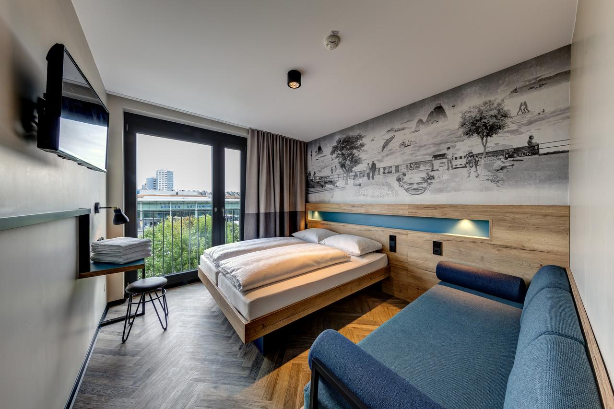

This hotel is located directly next the East Side Gallery in the cool Friedrichshain district of Berlin. Newly opened in August 2018, the hotel features free WiFi and a beer garden directly at the Berlin Wall.

Rooms at Schulz Hotel Berlin Wall at the East Side Gallery are individually and functionally furnished. All rooms offer free WiFi, a Smart TV and a design bathroom with shower and complimentary toiletries.

The Bakery offers fresh muesli, toasted panini and couscous salad, not to mention great coffee. A nice range of beers and cocktails are available at the bar, while barbecues and craft beers can be enjoyed in the beer garden.

Other facilities for guests at Schulz Hotel Berlin Wall include a guest kitchen, a laundry salon and a 328 ft² youth lounge with table football, bean bags, a cinema screen and music system.

Nearby Ostbahnhof train station offers excellent public transport connections to all parts of Berlin, including Alexanderplatz, Potsdamer Platz, Berlin Main Station, the Messe Berlin Trade Fair, Tegel Airport and Schönefeld Airport.

Friedrichshain-Kreuzberg is a great choice for travelers interested in atmosphere, culture and convenient public transportation.

Couples in particular like the location – they rated it 9.2 for a two-person trip.

## One of our best sellers in Berling!

This charmingly restored villa offers fully furnished apartments in Berlin's Treptow/Köpenick district. Haus am See features a large garden with a boat platform, as well as free WiFi and a free sauna and gym.

The apartments include a fully equipped kitchen, TV and a private bathroom. The apartments feature a balcony, terrace or a private area in the park that is ideal for barbecues or just relaxing.

Haus am See is 21 m from Lake Grimnitz and 150 m from the River Dahme. The accommodations is also 50 m from a restaurant, 100 m from a café/bar and 200 m from a supermarket.

On-site parking is free at Haus am See. Tegel Airport is 19 mi away.
