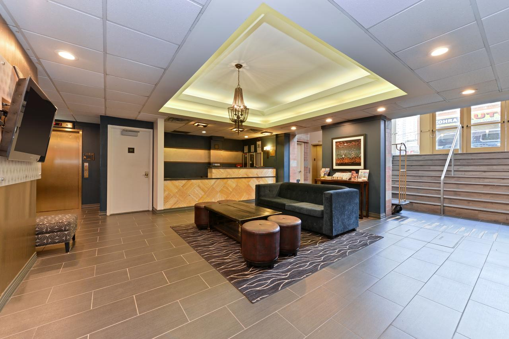

Located 500 m from the Javits Convention Center and the Lincoln Tunnel, Midtown Convention Center Hotel NYC features a daily continental breakfast. Free WiFi is available throughout the hotel.

The hotel offers rooms with 40-inch cable TV and a coffee maker. A work desk and ironing facilities are also included.

Guests of Midtown Convention Center Hotel NYC are welcome to use the on-site tour desk to help arrange their day in New York City. Laundry services are also available.

Midtown Convention Center Hotel NYC is 1 mi from Penn Station.

Hudson Yards is a great choice for travelers interested in skyline views, tourist attractions and city walks.

This is our guests' favorite part of New York, according to independent reviews.

## One of our best sellers in New York!

Located in New York, 601 m from Lincoln Center, The Watson Hotel features a restaurant, bar and free WiFi throughout the property. The hotel has a seasonal outdoor pool and fitness center. Private parking is available on site.

Each room at this hotel is air conditioned and is fitted with a flat-screen TV. You will find a coffee machine in the room. Each room has a private bathroom. Extras include free toiletries and a hairdryer.

You will find a 24-hour front desk and gift shop at the property.

Carnegie Hall is 701 m from The Watson Hotel, while Broadway Theater is 701 m from the property. The nearest airport is LaGuardia Airport, 6.2 mi from The Watson Hotel.

Hell's Kitchen is a great choice for travelers interested in tourist attractions, skyline views and city walks.

This is our guests' favorite part of New York, according to independent reviews. In this area you can shop 'til you drop for popular brands like H&M.
