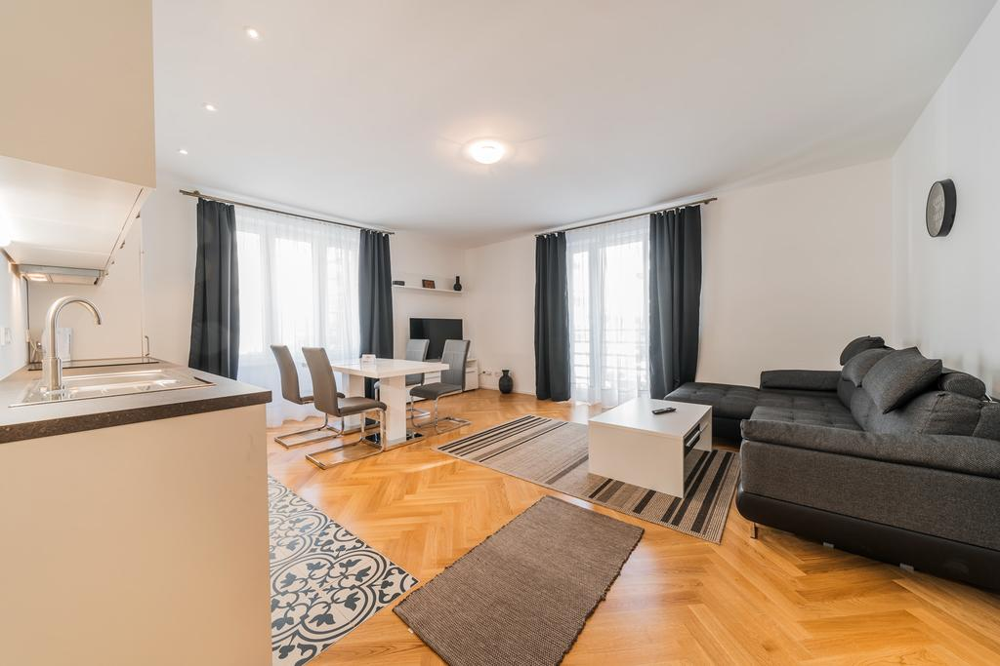

Set in Vienna, near House of Music, Imperial Treasury Vienna and Musikverein, Edelweiss City Apartments STATE OPERA features free WiFi.

Units come with a TV, a kitchenette with a dining area, and a private bathroom. A dishwasher, a microwave and fridge are also offered, as well as a kettle and a coffee machine.

Popular points of interest near the apartment include Albertina Museum, Graben and Austrian National Library. The nearest airport is Vienna International Airport, 12 mi from Edelweiss City Apartments STATE OPERA.

Innere Stadt is a great choice for travelers interested in cafes, culture and museums.

This is our guests' favorite part of Vienna, according to independent reviews.

## One of our best sellers in Vienna!

Set in Vienna, near House of Music, Imperial Treasury Vienna and Musikverein, Edelweiss City Apartments STATE OPERA features free WiFi.

Units come with a TV, a kitchenette with a dining area, and a private bathroom. A dishwasher, a microwave and fridge are also offered, as well as a kettle and a coffee machine.

Popular points of interest near the apartment include Albertina Museum, Graben and Austrian National Library. The nearest airport is Vienna International Airport, 12 mi from Edelweiss City Apartments STATE OPERA.

Innere Stadt is a great choice for travelers interested in cafes, culture and museums.

This is our guests' favorite part of Vienna, according to independent reviews.
